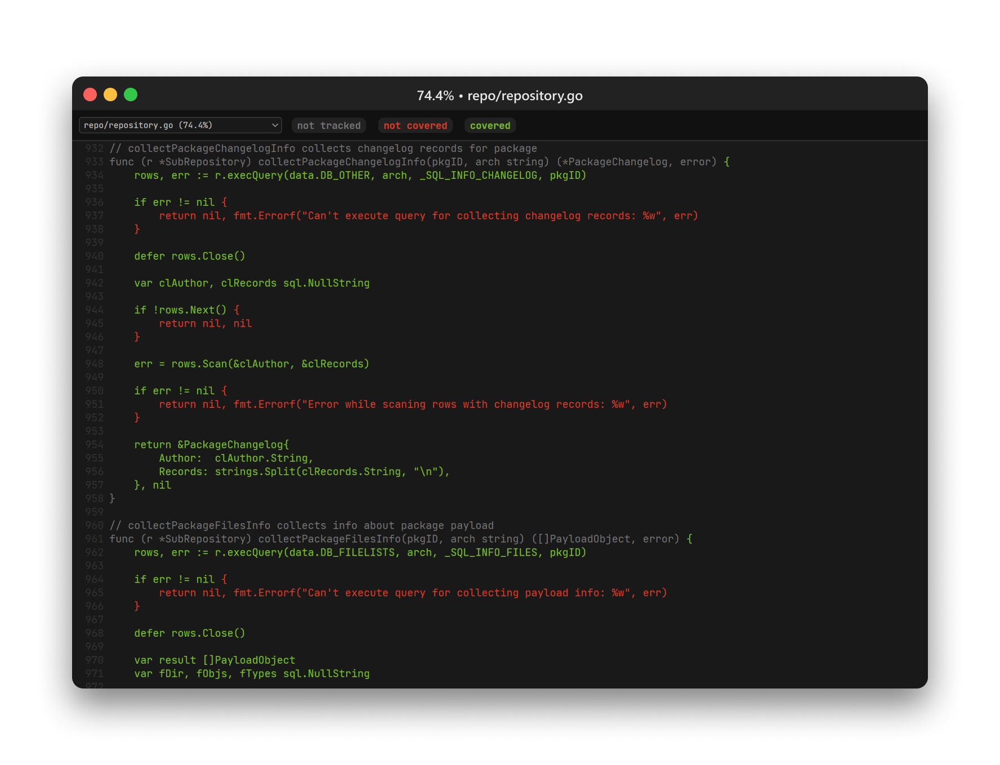
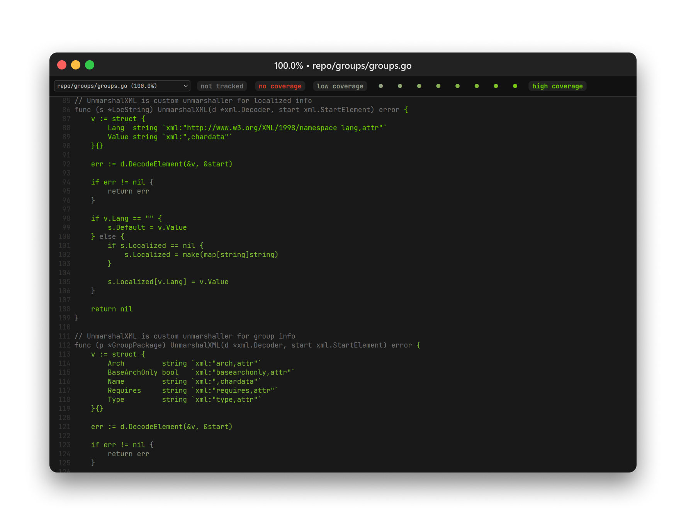

<p align="center"><a href="#readme"></a></p>

<p align="center">
  <a href="https://kaos.sh/w/htmlcov/ci"></a>
  <a href="https://kaos.sh/r/htmlcov"></a>
  <a href="https://kaos.sh/w/htmlcov/codeql"></a>
  <a href="#license"></a>
</p>

<p align="center"><a href="#installation">Installation</a> • <a href="#command-line-completion">Command-line completion</a> • <a href="#man-documentation">Man documentation</a> • <a href="#usage">Usage</a> • <a href="#ci-status">CI Status</a> • <a href="#contributing">Contributing</a> • <a href="#license">License</a></p>

<br/>

`htmlcov` is an utility for converting Go coverage profiles into HTML pages. It's just better version of `go tool cover -html=cover.out -o coverage.html` command.





### Installation

#### From source

To build the `htmlcov` from scratch, make sure you have a working Go 1.18+ workspace (_[instructions](https://go.dev/doc/install)_), then:

```
go install github.com/essentialkaos/htmlcov@latest
```

#### Prebuilt binaries

You can download prebuilt binaries for Linux and macOS from [EK Apps Repository](https://apps.kaos.st/htmlcov/latest):

```bash
bash <(curl -fsSL https://apps.kaos.st/get) htmlcov
```

### Command-line completion

You can generate completion for `bash`, `zsh` or `fish` shell.

Bash:
```bash
sudo htmlcov --completion=bash 1> /etc/bash_completion.d/htmlcov
```

ZSH:
```bash
sudo htmlcov --completion=zsh 1> /usr/share/zsh/site-functions/htmlcov
```

Fish:
```bash
sudo htmlcov --completion=fish 1> /usr/share/fish/vendor_completions.d/htmlcov.fish
```

### Man documentation

You can generate man page using next command:

```bash
htmlcov --generate-man | sudo gzip > /usr/share/man/man1/htmlcov.1.gz
```

### Usage

<p align="center"></p>

### CI Status

| Branch | Status |
|--------|----------|
| `master` | [](https://kaos.sh/w/htmlcov/ci?query=branch:master) |
| `develop` | [](https://kaos.sh/w/htmlcov/ci?query=branch:develop) |

### Contributing

Before contributing to this project please read our [Contributing Guidelines](https://github.com/essentialkaos/contributing-guidelines#contributing-guidelines).

### License

[Apache License, Version 2.0](http://www.apache.org/licenses/LICENSE-2.0)

<p align="center"><a href="https://essentialkaos.com"></a></p>
